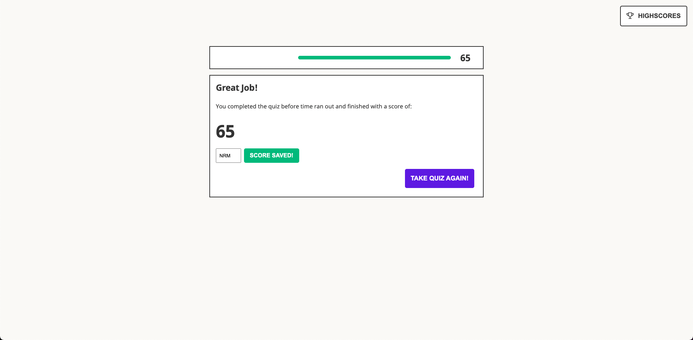

# JavaScript Speed Quiz

This application is a web based JavaScript quiz meant to test your JavaScript knowledge in 100 seconds or less! The quiz also allows you to save your high score to a list that can be accessed via the user interface.

## How it Works

The questions for the quiz are stored in an array of objects. When the user starts the quiz, the questions are re-ordered randomly using the Fisher-Yates algorithm, which creates an entriely unbiased order each time it is run. If the user answers a question incorrectly, 5 seconds are deducted from the timer and then incorrect correct has a style changes to show it is incorrect. If the user answers correctly, the question is wiped from the UI and populated with the following question in the shuffled array. 

If the user runs out of time before the quiz is over, they are presented with a message speaking to that, and are not presented with the option to save their score. Conversely, if they answer all of the question before the timer reaches zero, they are presented with a congratulatory message and the option to save thier score. Both scenarios then offer the option to retake the quiz, which will present the question in a new randomized order.

## The Highscores

The highscroes are written to local storage in the browser and thereby persist on page refresh. The user also has the ability to clear the highscores from local storage directly from the UI. 

## Screenshots

